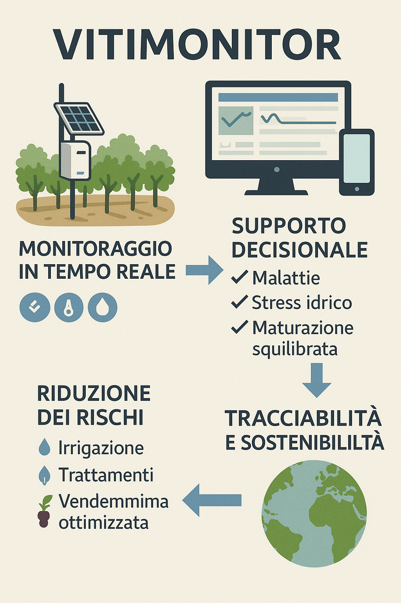

# 🍇  Vitimonitor - Documentazione

  

Benvenuto nella documentazione tecnica e funzionale del progetto **Vitimonitor**, una piattaforma integrata per la gestione intelligente della viticoltura basata su modelli predittivi, sensori IoT, analisi dati e intelligenza artificiale.

Questa documentazione include:

- 💡 L’idea progettuale
- 📊 I modelli agronomici e predittivi
- 📐 I requisiti funzionali e tecnici
- 🔧 Il prototipo MVP
- 🛣️ La roadmap evolutiva
- 📋 Il questionario di validazione
- 📘 I feedback raccolti da enologi

Ogni sezione è pensata per accompagnare il team tecnico, gli stakeholder agronomi e i partner nello sviluppo e nella validazione del sistema.

> **Nota:** La documentazione è in costante aggiornamento.

