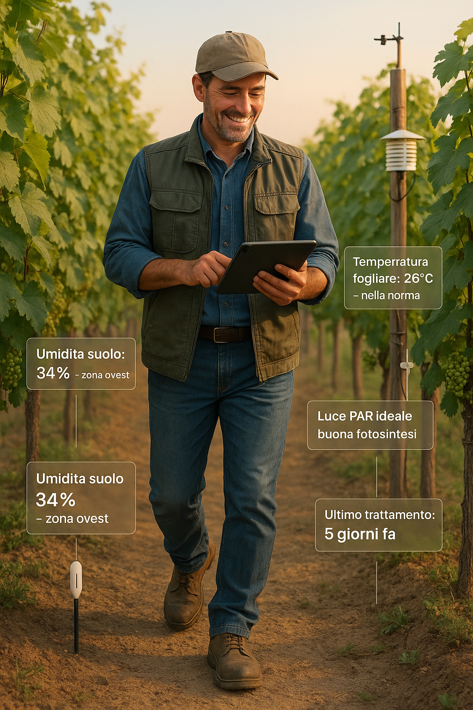

# 💡 Vitimonitor: uno strumento per conoscere meglio il vigneto

**Vitimonitor** è un sistema progettato per chi vive e lavora tra i filari.
Ti aiuta a osservare cosa accade nel vigneto in tempo reale, con dati affidabili e comprensibili.
Ogni informazione raccolta è pensata per migliorare il lavoro quotidiano e facilitare le decisioni in campo.

---

## 🌱 Perché usare Vitimonitor

- Ti mostra quando il suolo è troppo secco o la vite soffre il caldo.
- Ti aiuta a decidere **quando irrigare o trattare**, evitando sprechi.
- Ti avvisa **prima che ci siano problemi**, come stress o malattie.
- Ti fa risparmiare tempo e risorse, con informazioni già pronte all’uso.
- Ti permette di vedere tutto su una **dashboard chiara**, accessibile da PC o smartphone.

---

## 🔍 Come funziona

- Dispositivi semplici da installare rilevano **temperatura**, **umidità** e **luce**.
- I dati vengono trasmessi automaticamente a un punto di raccolta centrale.
- Tutto viene mostrato su una dashboard facile da leggere, con **grafici**, **avvisi**, e **cronologie**.
- Non serve nessuna configurazione complessa: pensato per chi lavora sul campo.

---

## 📊 Cosa puoi osservare

- Se il vigneto ha bisogno di acqua o di essere protetto da un colpo di calore.
- Come cambia il clima da una zona all’altra della stessa vigna.
- Quando ci sono condizioni favorevoli a malattie fungine.
- Come sta andando la stagione rispetto agli anni passati.

---

## 👤 A chi serve

| Figura professionale | Come può usare Vitimonitor|
|--------------------------|------------------------------------------------------|
| **Viticoltore / Tecnico**| Controlla l’andamento del campo e riceve avvisi |
| **Enologo**| Pianifica la vendemmia osservando maturazione e clima|
| **Agronomo** | Analizza dati su suolo, clima e salute della vite |
| **Titolare azienda** | Confronta stagioni e ottimizza investimenti |

---

## 🌟 I vantaggi pratici

- **Uva di qualità più alta**, più uniforme e più sana.
- **Meno interventi inutili**: solo quando servono davvero.
- **Controllo continuo**, anche se non sei fisicamente in vigna.
- **Una gestione moderna** e sostenibile, senza perdere la tradizione.

---

## 🚀 Cosa stiamo realizzando

1. I primi **moduli sensore** pronti da installare.
2. Un **centro dati** per raccogliere e proteggere le informazioni.
3. Una **dashboard semplice** per consultare i dati in pochi clic.
4. Test sul campo con **aziende vitivinicole** che ci affiancano nella crescita.
5. Nuove funzioni intelligenti per previsioni, allarmi automatici e supporto alle decisioni.

---

