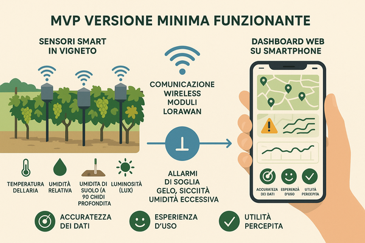

# MVP – Versione Minima Funzionante  
Sistema di Monitoraggio per Viticoltura di Precisione

---

## 🎯 Obiettivo
Testare sul campo una versione semplificata ma utile del sistema, per validarne efficacia, utilità e desiderabilità presso aziende reali.

---

## 🧰 Componenti Hardware

- **Moduli sensore (2–3 unità):**
  - Temperatura aria
  - Umidità relativa
  - Umidità suolo (30 cm)
  - Luminosità (lux)
- **Alimentazione:** batteria + pannello solare
- **Comunicazione:** LoRaWAN o LTE-M

---

## 📱 Componenti Software

- Interfaccia web (mobile-friendly)
- Dashboard con:
  - Valori sensori aggiornati
  - Mappe di posizionamento
  - Allarmi soglia (gelo, secco, eccesso UR)
  - Cronologia ultimi 7–14 giorni

---

## 🔬 Test di campo

- **Numero aziende coinvolte:** 3
- **Zona:** diverse regioni vitivinicole
- **Periodo:** 2–3 mesi (ideale: invaiatura → vendemmia)
- **Attività:** 
  - Raccolta feedback
  - Verifica precisione dati
  - Valutazione esperienza d'uso

---

## 📊 Valutazione MVP

| Criterio                  | Metodo di valutazione        |
|--------------------------|------------------------------|
| Qualità e coerenza dati  | Confronto con stazione meteo |
| Usabilità interfaccia    | Test utente + questionario   |
| Utilità percepita        | Interviste qualitative       |
| Interesse all’acquisto   | Intenzione dichiarata        |

---

## 🚀 Step Successivi

- Espansione sensoristica (Fase 2)
- Integrazione modelli agronomici
- Business plan per distribuzione e supporto
- Ricerca partner (PSR, bandi innovazione, incubatori)

