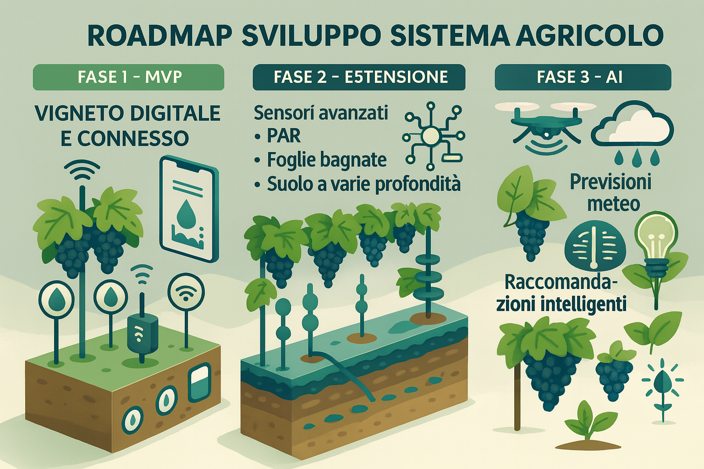

# Roadmap di Sviluppo Tecnico  
Sistema di Monitoraggio per il Settore Vitivinicolo

## 🎯 Obiettivo Generale
Costruire un sistema hardware/software completo per l'agricoltura di precisione in vigneto, scalabile e basato sui reali bisogni degli enologi e viticoltori.

---

## 🧩 Fase 1: MVP (Versione Minima Funzionante)
**Obiettivo:** Validare il sistema su piccola scala

### ✅ Funzionalità:
- Sensori:
  - Temperatura aria
  - Umidità aria
  - Umidità suolo (30 cm)
  - Luminosità (lux)
- Dashboard web/mobile:
  - Visualizzazione dati in tempo reale
  - Allarmi soglia
  - Cronologia ultimi 7–14 giorni

---

## 🔧 Fase 2: Estensione Sensoristica & Modelli
**Obiettivo:** Copertura agronomica più completa

### 🔍 Nuovi sensori:
- Umidità suolo a 10/30/60 cm (profilo idrico)
- Leaf Wetness Sensor
- Sensore PAR (Photosynthetically Active Radiation)
- Microsonde temperatura grappolo

### 🧠 Algoritmi integrati:
- Evapotraspirazione (ET0 – Penman-Monteith)
- Growing Degree Days (GDD)
- Modelli rischio fitopatologico

---

## 🤖 Fase 3: Supporto Decisionale & AI
**Obiettivo:** Diventare un assistente agronomico evoluto

### 🧠 Funzionalità:
- Raccomandazioni irrigazione, trattamenti, vendemmia
- Previsioni meteo integrate
- Alert intelligenti personalizzati

### 📷 Intelligenza artificiale:
- Riconoscimento acini/foglie (stress, malattie, maturazione)
- Previsione automatica data vendemmia ottimale

